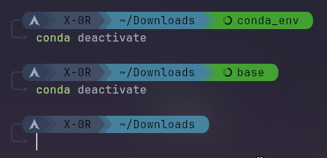

# ZSHx - Modern Sleek ZSH Configuration

A modern, sleek, and simplistic ZSH prompt configuration that enhances your terminal experience with beautiful visual indicators and intelligent features.

## Features

### 🎨 Modern & Sleek Design
- **Clean visual aesthetics** with smooth color transitions
- **OS-aware logos** that automatically detect your distribution (Arch, Ubuntu, Kali, Parrot)
- **Minimalistic approach** that doesn't clutter your terminal
- **Responsive design** that adapts to different terminal sizes

### 🔧 Git Repository Integration
Perfect for developers working with version control:


- **Branch information** with clear visual indicators
- **Commit status tracking**: ahead/behind indicators with superscript numbers
- **Working directory status**: staged files (󰱑), conflicts (!), modified files (), and untracked files ()
- **Visual git status** that helps you understand your repository state at a glance

### 🛠️ Development Environment Support
Stay aware of your active workspace with intelligent environment detection. ZSHx currently supports:

- **Python venv**: Native virtual environment detection.  
  
- **Conda**: Full support for Anaconda and Miniconda environments.  


- **Environment name display** for easy identification
- **Clear visual separation** from other prompt segments
- **Seamless integration** with your data science and development workflows

### 💼 Background Job Management
Keep track of your running processes:


- **Active job counter** showing number of background processes
- **Visual job status** integrated into the prompt
- **Never lose track** of running tasks

### 🔐 Root User Highlighting
Enhanced security awareness:


- **Visual root indicators** with distinct red coloring
- **Clear privilege escalation warnings**
- **Immediate visual feedback** when running as root

### ⚡ Enhanced User Experience

#### Smart Autocompletion
- **Menu-style completion** with arrow key navigation
- **Case-insensitive matching** for faster command entry
- **Intelligent caching** for improved performance
- **Group-organized suggestions** for better readability

#### Syntax Highlighting
- **Real-time command highlighting** as you type
- **Error detection** with visual feedback
- **Argument and option highlighting** for clarity
- **String and path highlighting** for better readability

#### History Management
- **Fuzzy history search** with `Ctrl+R`
- **Intelligent history sharing** across sessions
- **Duplicate elimination** for cleaner history
- **Command editing** with `Ctrl+X+E`

## Installation

1. Clone this repository:
   ```bash
   git clone [https://github.com/salah-chafai/zshx.git](https://github.com/salah-chafai/zshx.git)
   cd zshx
   ```

2. Copy the configuration:
   ```bash
   cp .zshx ~/.zshx
   echo "source ~/.zshx" >> ~/.zshrc 
   ```

3. Install required plugins (optional but recommended):
   ```bash
   # On Arch Linux
   sudo pacman -S zsh-autosuggestions zsh-syntax-highlighting

   # On Ubuntu/Debian
   sudo apt install zsh-autosuggestions zsh-syntax-highlighting

   # On macOS (via Homebrew)
   brew install zsh-autosuggestions zsh-syntax-highlighting
   ```

4. Restart your terminal or source the configuration:
   ```bash
   source ~/.zshrc
   ```

## Customization

### Color Scheme
The configuration uses a carefully crafted color scheme that you can customize by modifying the color variables at the top of `.zshrc`:

```bash
zsh_os_bg=#334159      # OS segment background
zsh_user_bg=#415166    # User segment background
zsh_dir_bg=#4587a1     # Directory segment background
zsh_git_bg=#3ba883     # Git segment background
zsh_env_bg=#e0af60     # Dev environment (Python/Conda) background
zsh_jobs_bg=#6a4f7a    # Jobs segment background
```

### Path Truncation
Adjust the directory display depth by modifying the `depth` variable in the `truncate_path()` function.

## Key Bindings

- `Ctrl+R`: Fuzzy history search
- `Ctrl+Space`: Accept autosuggestion
- `Ctrl+X+E`: Edit command in editor
- `↑/↓`: Navigate through command history with context
- `Tab`: Menu-style completion

## Prompt Segments

The prompt consists of several segments that appear conditionally:

1. **OS Logo**: Distribution-specific icon
2. **Username**: Current user with visual styling
3. **Directory**: Truncated current path
4. **Git Status**: Branch and repository information (when in git repo)
5. **Dev Environment**: Active Python venv or Conda environment name
6. **Background Jobs**: Number of running jobs (when > 0)

## Requirements

- ZSH shell
- Optional: `zsh-autosuggestions` and `zsh-syntax-highlighting` plugins
- A terminal with Unicode and color support

## Contributing

Contributions are welcome and greatly appreciated! Feel free to submit issues, feature requests, or pull requests to improve this configuration.

## License

This project is open source and available under the [MIT License](LICENSE).

---

*Enjoy your enhanced terminal experience with ZSHx!* ✨
